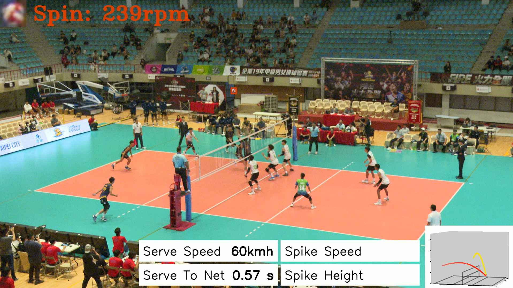
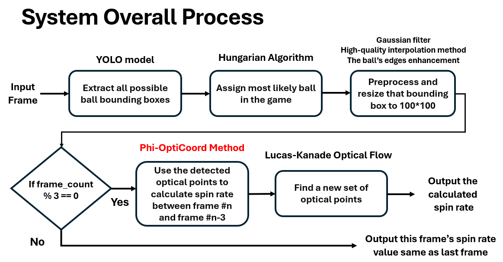
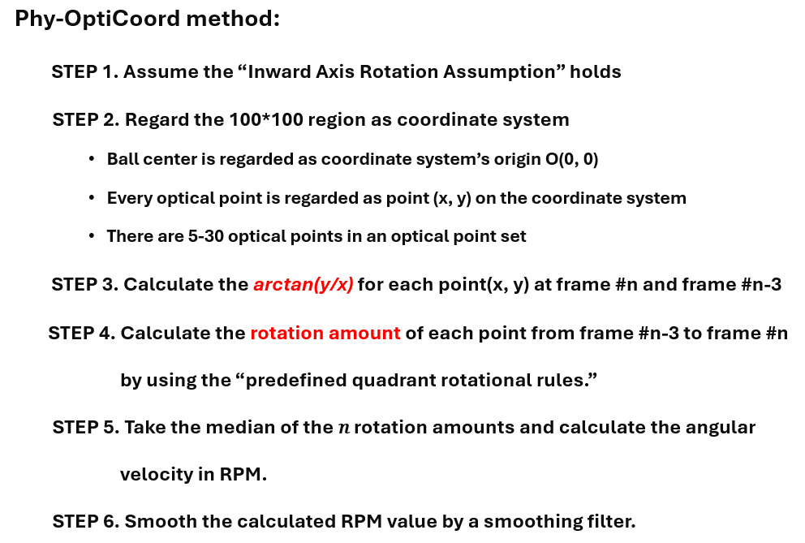

# 🏐 Volleyball 3D Trajectory Reconstruction and Analysis System – Spin Analysis

### 🧠 Overview  
Developed a **real-time (60 FPS) volleyball spin-rate analysis system** using **YOLO**, **Python**, and **OpenCV**, achieving **~90% average accuracy** in real-match conditions.  
The system introduces the **Phi-OptiCoord Method**, a coordinate-based optical-physics algorithm that estimates ball spin (in RPM) from single-view videos.  

Integrated the spin module into the existing **3D trajectory reconstruction and velocity analysis system** within 2 weeks, enabling combined analysis of **speed + spin + trajectory**.  

Deployed in **live sports broadcasts** including:  
🏐 *2024 Enterprise Volleyball League (2024企業排球聯賽)*  
🏐 *2025 World Masters Games (2025世界壯年運動會)*

> **This technology has been applied in:**  
> 1️⃣ *Volleyball Technology Analysis in Top Volleyball League (TVL)*  (台灣企業排球聯盟聯賽)

> 2️⃣ *National Science and Technology Council (NSTC) Project — “Building Enhanced Audience Engagement and Immersive Multimedia Experiences for 5G Smart Stadiums through Crowd Live Streams”* (國科會計畫 - 透過群眾直播串流來建構增強“觀眾參與度及沉浸式多媒體”之5G智慧體育館)

> 3️⃣ *Sports Talent Development Program, Sports Administration, Ministry of Education (Taiwan)* (體育署 - 人才培育計畫)

---

### ▶️ Real-time Demo Video (Click below image to see the demo video❗)
Video URL: https://reurl.cc/lYmebd

[](https://drive.google.com/file/d/1jdj1GaYSzLHUzUOO6BreVJPa8HyNrAan/view?usp=sharing)

---

### ⚙️ System Design  


```text
Input: Single-view match video  
   │
   ├─ YOLO model → Detect volleyball candidates
   ├─
   ├─ Hungarian Algorithm → Identify and track the main game ball
   │
   ├─ Bounding box upscale (100×100 px) with Gaussian filtering and edge enhancement
   │
   ├─ Phi-OptiCoord Method → Estimate rotational motion from optical flow
   │
   └─ Output: Real-time RPM + Color-coded visualization (Green / Yellow / Red)
```

---

### 🔬 Phi-OptiCoord Method  


**1️⃣ Optical Flow Detection**  
Use **Lucas–Kanade optical flow** to extract 5–30 key motion points on the volleyball surface.

**2️⃣ Coordinate Setup**  
Treat the 100×100 px bounding box as a local (x, y) coordinate system; O(0, 0) is the ball’s center.

**3️⃣ Angular Measurement**  
For each flow point, compute `arctan(y/x)` at frame #n and frame #n + 3.

**4️⃣ Rotation Delta**  
The change in `arctan(y/x)` gives each point’s rotation angle over three frames.

**5️⃣ Median Aggregation**  
Take the **median** of all angular changes as the representative spin angle.

**6️⃣ Temporal Smoothing**  
Apply a low-pass filter for stable real-time output:  
```
new_spin = new_spin * 0.2 + old_spin * 0.8
```

→ Convert angular velocity to **RPM (rotations per minute)** based on FPS and time interval.

---

### 🌈 Visualization  
| Spin Level | RPM | Color |  
|-------------|-----|--------|  
| High | > 200 | 🔴 Red |  
| Medium | 100 – 200 | 🟡 Yellow |  
| Low | < 100 | 🟢 Green |  

The real-time system overlays the RPM value and color cue directly onto the broadcast feed for intuitive visual analysis.

---

### 💡 Key Features  
- ⚙️ **Phi-OptiCoord Method** — Hybrid optical-flow + physics-based spin estimation.  
- 🧩 **YOLO + Hungarian tracking** — Ensures precise ball matching between frames.  
- 🔍 **Adaptive bounding-box enhancement** — Improves clarity for small distant targets.  
- 🧠 **Stable 3-frame computation cycle** — Balances responsiveness and noise reduction.  
- ⚡ **60 FPS real-time inference** — Seamless integration with 3D trajectory and speed analysis modules.  
- 🎥 **Broadcast-ready deployment** — Used in professional volleyball events.  

---

### 📊 Results & Demo  
*(Insert real-time demo screenshots or video links here)*  

| Metric | Value |  
|---------|--------|  
| Frame Rate | 60 FPS |  
| Average Accuracy | ~90 % |  
| Output Frequency | Every 3 frames |  
| Integration Time | < 2 weeks |  
| Deployment | Enterprise League 2024 / W.M. Games 2025 |  

---

### 🧭 What I Learned  
- Combined **computer vision** and **physics** to analyze rotational motion.  
- Implemented **end-to-end tracking → rotation → visualization** pipeline.  
- Optimized **YOLO + Hungarian** tracking for real-world broadcast scenarios.  
- Designed **real-time visual feedback UI** suitable for coaching and live commentary.  

---

### 📂 Repository Structure  
```bash
volleyball-spin-analysis/
│
volleyball-spin-analysis/
│
├── camera_utils/                 # Camera calibration, lens correction, and capture utilities
├── camsets/                      # Camera parameter presets and configurations
├── data/                         # Raw video and annotation data
├── doc_image/                    # Documentation and reference images
├── json_results/                 # Inference results exported as JSON files
├── run_scripts/                  # Execution scripts for experiments and pipeline automation
├── rw_run_scripts/               # Real-world execution batch scripts
├── spin_application/             # Main application for spin-rate estimation
├── test_results/                 # Output and test comparison data
│
├── .gitignore                    # Git ignore configuration
│
├── analyze_spikes.py             # Analyze spike trajectories and ball velocity profiles
├── check_gpu.py                  # GPU device checking and environment validation
├── detector.py                   # YOLO-based volleyball detection module
├── export.py                     # Export utility for video results and statistics
├── fix_dataset.py                # Dataset repair and frame alignment tool
├── geometry.py                   # Geometric transformation and coordinate functions
├── inference.py                  # Main inference pipeline (non-spin)
├── inference_with_spin.py        # Combined inference with spin-rate computation
├── inference_process.py          # Frame-wise inference control process
├── inference_thread.py           # Threaded inference for real-time execution
├── inference_process_retry.py    # Redundant inference process (error recovery)
├── inference_process_retry2.py   # Second-stage fallback for inference retry
├── make_analyze_video_resize.py  # Video resizing and aspect correction for analysis
├── measure.py                    # Ball speed and distance measurement functions
├── preprocess.py                 # Frame preprocessing (cropping, filtering)
├── pipeline.py                   # Full pipeline orchestration script
├── roiPreprocesser.py            # Region of Interest (ROI) preparation for analysis
├── spin.py                       # Phi-OptiCoord Method spin-rate computation core
├── sync_play.py                  # Synchronization utility for playback and annotation
├── train_yolov8.py               # YOLOv8 model training script for volleyball detection
├── visuals.py                    # Visualization and overlay generation
│
├── yolov8n_conti_1280_v1.pt      # YOLOv8 model (Conti volleyball variant)
├── yolov8n_mikasa_1280_v1.pt     # YOLOv8 model (Mikasa volleyball variant)
│
├── NotoSansTC-Medium.ttf         # Font for on-screen annotation
├── rally_rw.py                   # Rally sequence reconstruction script
├── rally_rw_withSpin_20250410_1330.py  # Rally analysis with spin module
├── rallyWithSpin_20250410_1330.py      # Alternative spin-integrated rally playback
├── rally_rw_withSpin_20250410_1330.py  # Alternate version for real-world dataset
│
└── README.md                     # Project documentation (this file)

```

---

### 📄 License & Citation / Deployment  
- Spin analysis module has integrated with “Volleyball 3D Trajectory Reconstruction & Velocity Analysis System” 
- [成大智慧運動科技團隊](https://sportslab.ncku.edu.tw/) 
- [企業排球聯賽成大場開打 智慧運動科技轉播技術直播亮相](https://web.ncku.edu.tw/p/404-1000-249219.php?Lang=zh-tw)
- [朱威達教授榮獲工程教授獎 主力為運動科技相關應用](https://twpowernews.com/news_pagein.php?iType=1011&n_id=276920)
> 

---

### ✨ Summary  
> A high-speed, physics-aware **volleyball spin-rate analysis system** based on the **Phi-OptiCoord Method**, achieving real-time, color-coded RPM visualization integrated with 3D trajectory analytics for professional match analysis.
